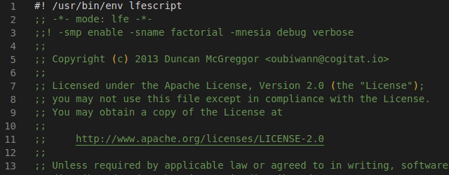
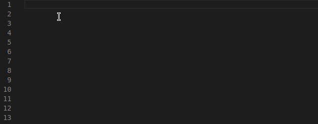
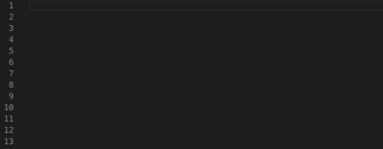
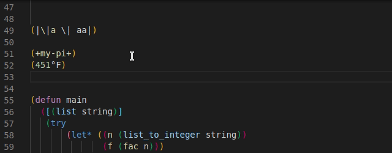

# **LFE ([Lisp Flavored Erlang](https://lfe.io/)) language support**

## Features

This VSCode extension support:
- Syntax highlighting

- Snippets

- Code completitions for standard modules

- Go to / Peek at definitions

## Requirements
- Installed LFE 

---

**Enjoy!**
